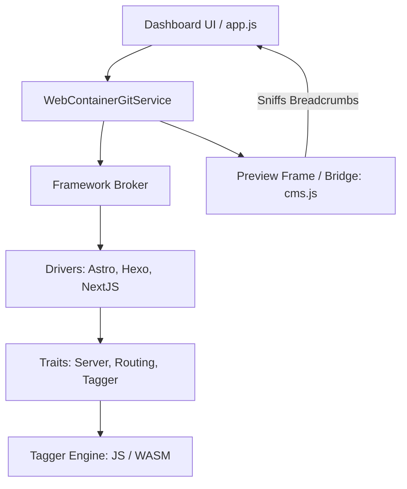

# ZeroCMS Architecture Overview

This document outlines the core technical principles of ZeroCMS. We strive for **"Architectural Gold"**—a system that is modular, deterministic, and highly performant—while acknowledging that many of these components are still in early development.

## 1. The Core Engine (WebContainer + Git)
ZeroCMS is an **In-Browser IDE-as-a-Service**. It uses:
- **WebContainers**: A WASM-based Node.js runtime that executes your real project inside the browser sandbox.
- **Isomorphic-Git**: A pure JS implementation of Git that handles the synchronization between your local browser filesystem (`lightning-fs`) and GitHub.

## 2. Declarative Framework Broker
Instead of hardcoding framework support, we use a **Declarative Driver** system.
- **Drivers**: Simple configuration objects in [lib/frameworks/drivers/](file:///Users/martin/Documents/Projects/0CMS/lib/frameworks/drivers/) that define how to detect a project (e.g., `package.json` dependencies).
- **Traits**: Functional modules (`Server`, `Routing`, `Content`, `Templating`) that are "hydrated" from these drivers. This allows us to support new frameworks like **Astro** or **Hexo** by just adding a single config file.

## 3. The Super Tagger (Deterministic Traceability)
Unlike other CMS tools that use "Fuzzy Matching," ZeroCMS uses **Deterministic Instrumentation**.
- **Invisible Breadcrumbs**: We inject zero-width Unicode characters into your content files in the WebContainer memory.
- **Source Mapping**: When you click an element in the preview, our bridge "sniffs" these characters to map the DOM element back to the exact source file and line number.
- **Dual-Engine Model**: 
    - **JsEngine**: For standard projects (fast, zero weight).
    - **WasmEngine**: A high-performance Rust core for massive monorepos (currently in development).

## 4. Performance: Quantum Pre-warming
To achieve a "Zero-Friction" feel, we implement **Background Pre-warming**:
- The engine starts booting the WebContainer as soon as the user hits the landing page.
- By the time the user selects a repository and logs in, the Node environment is already "warm," cutting wait times by up to 80%.

## 🏗 System Map

## 🚧 Status: Work In Progress
Large parts of this architecture are still evolving. The **WASM Engine** is currently a bridge with a JS fallback, and many framework drivers are still in "Beta" or "Planned" status.
